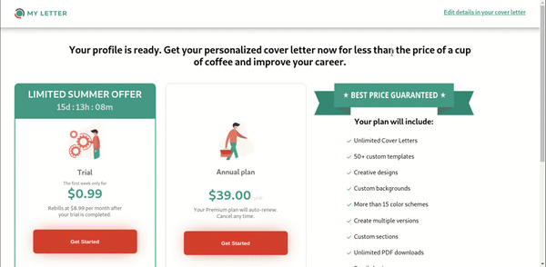

# Programming Task

Website with ability to choose subscription. Made with Formik and Yup (form validation), React-slick (slider) and React-router.

## Prerequisites

Install [node.js](https://nodejs.org/en/) and [npm](https://www.npmjs.com/).

## Getting Started

#### Clone repository:

`git clone https://github.com/IselDrew/https://github.com/IselDrew/Payment-page.git`

#### Install dependencies:

`npm install`

#### Start application:

`npm start`

## Application preview

